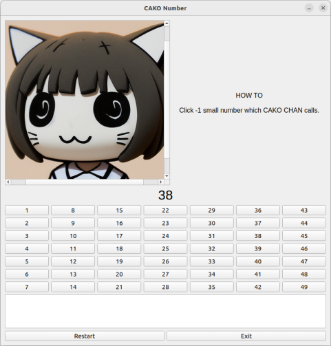

# CAKO_CHAN
ca(t)+ko = cako chan is character from cat


# Concept of CAKO_CHAN
- Educational game for kids
- select number which is -1 number with calling by cako chan.
- We can play 20 times questions unless you have correct answer.

# Call script

```
python cako_chan.py 

```
## install module

```
pip install PyQt5

```
- PyQt5 is released under the GPL v3 license and under a commercial license that allows for the development of proprietary applications.

# How to
- Just click correct number.
- If cako chan called "38",  you should click 37.
- It may be slow for adult user to achieve the select target. you can adujst parameter which is commented out.

## Play screen

  
